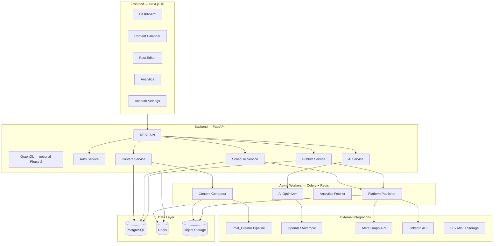
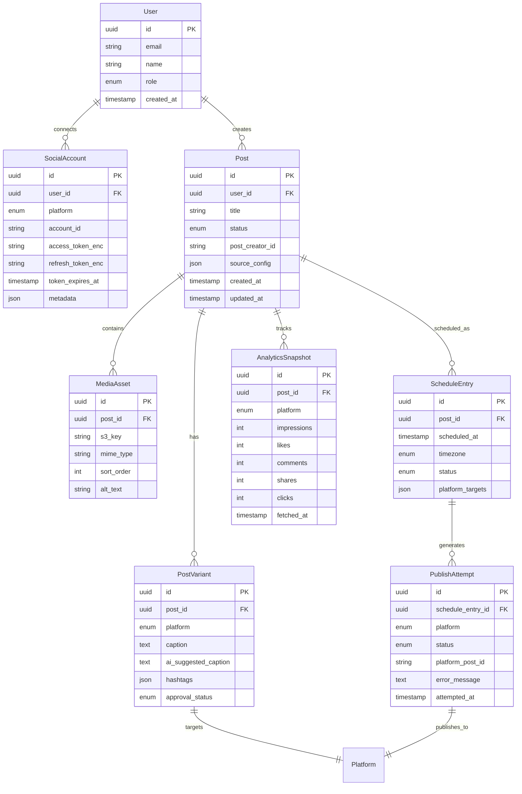
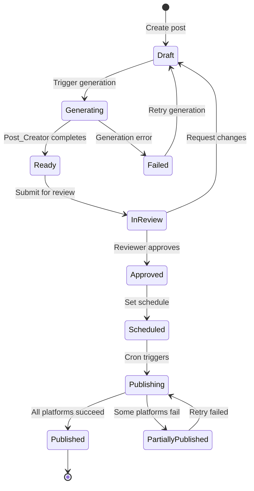
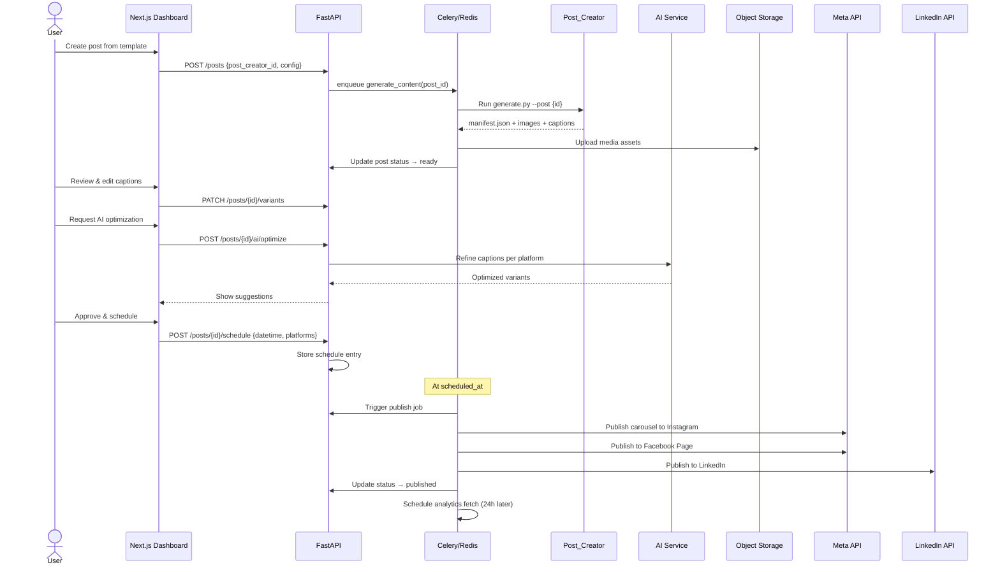
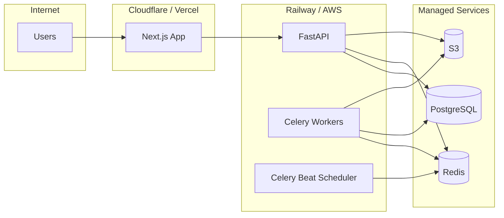

# Pulse — Architecture (future reference)

> **You can ignore this for now.** This is the long-term plan. The app works without any of this complexity — see [README.md](./README.md) to just run it.

---

## Why Build Instead of Buy?

| Capability | Buffer/Sprout | Pulse (Custom) |
|---|---|---|
| Content generation | Manual upload | Integrated with `Post_Creator` + AI |
| Platform-specific captions | Manual per platform | Auto-generated + AI refinement |
| Approval workflow | Limited on free tiers | Custom multi-step review |
| Brand compliance | Generic | USC/CPBH brand rules baked in |
| Cost | $15–249/mo per seat | Infrastructure only (~$30–80/mo) |
| Portfolio value | None | Full-stack showcase project |
| Data ownership | Vendor-hosted | Self-hosted, HIPAA-aware design |

---

## High-Level Architecture



---

## Tech Stack

### Frontend — `apps/web`
| Layer | Technology | Why |
|---|---|---|
| Framework | **Next.js 15** (App Router) | SSR, API routes, excellent DX |
| Language | **TypeScript** | Type safety across the stack |
| UI | **Tailwind CSS + shadcn/ui** | Beautiful, accessible components |
| State | **TanStack Query + Zustand** | Server state + lightweight client state |
| Forms | **React Hook Form + Zod** | Validated forms with great UX |
| Calendar | **FullCalendar** | Drag-and-drop scheduling UI |
| Charts | **Recharts** | Analytics dashboards |

### Backend — `apps/api`
| Layer | Technology | Why |
|---|---|---|
| Framework | **FastAPI** | Async Python, integrates with Post_Creator |
| Language | **Python 3.12+** | Same ecosystem as content generator |
| ORM | **SQLAlchemy 2.0 + Alembic** | Mature, async-capable ORM |
| Validation | **Pydantic v2** | Request/response schemas |
| Auth | **JWT + OAuth 2.0** | Secure API + social account linking |
| Task Queue | **Celery + Redis** | Reliable async job processing |
| Storage | **boto3 → S3/MinIO** | Media asset storage |

### AI Layer — `apps/api/services/ai`
| Capability | Technology |
|---|---|
| Caption refinement | OpenAI GPT-4o / Anthropic Claude |
| Hashtag optimization | Fine-tuned prompts + brand rules |
| Best-time-to-post | Historical engagement analysis |
| Content review | AI compliance checker (brand voice, medical claims) |
| Alt-text generation | Vision model for accessibility |

### Infrastructure
| Component | Technology |
|---|---|
| Database | PostgreSQL 16 |
| Cache / Queue | Redis 7 |
| Object Storage | MinIO (dev) / AWS S3 (prod) |
| Containerization | Docker + Docker Compose |
| CI/CD | GitHub Actions |
| Deployment | Railway / Fly.io / AWS ECS |
| Monitoring | Sentry + structured logging |

---

## Core Domain Model



---

## Post Lifecycle (State Machine)



**Status enum:** `draft` → `generating` → `ready` → `in_review` → `approved` → `scheduled` → `publishing` → `published` | `partially_published` | `failed`

---

## End-to-End Posting Pipeline



---

## Platform Integration Details

### Instagram & Facebook (Meta Graph API)
- **Auth:** OAuth 2.0 via Facebook Login
- **Instagram:** Requires Business/Creator account linked to Facebook Page
- **Publishing:** `POST /{ig-user-id}/media` → `POST /{ig-user-id}/media_publish`
- **Carousels:** Upload each image, create carousel container, publish
- **Rate limits:** 200 calls/hour per user (batch where possible)

### LinkedIn
- **Auth:** OAuth 2.0 with `w_member_social` or `w_organization_social` scope
- **Publishing:** `POST /rest/posts` (Images API for media upload)
- **Carousels:** Document post format or multi-image post
- **Rate limits:** 100 posts/day per member

### Token Management
- Encrypt tokens at rest (Fernet / AWS KMS)
- Background job refreshes tokens before expiry
- Alert user if re-auth needed

---

## AI Integration Points

### 1. Caption Optimizer
```
Input:  base caption, platform, brand guidelines
Output: platform-optimized caption with character limits
        Instagram: 2200 chars, emoji-friendly, hashtag block
        LinkedIn:    3000 chars, professional tone
        Facebook:    63206 chars, conversational
```

### 2. Hashtag Engine
- Pull from `DEFAULT_HASHTAGS` in Post_Creator config
- AI suggests 5–10 relevant tags per post topic
- Enforce USC/CPBH brand tag inclusion

### 3. Best Time to Post
- Analyze historical `AnalyticsSnapshot` data
- Suggest optimal windows per platform
- Default fallbacks: Tue/Thu 10am PT for LinkedIn, Wed 11am for Instagram

### 4. Content Compliance Review
- Flag medical claims that need disclaimer
- Check brand voice consistency
- Verify CTA slide presence for clinic posts

### 5. Alt-Text Generator
- Vision model describes each carousel slide
- Improves accessibility and SEO

---

## API Design (REST)

```
Auth
  POST   /auth/login
  POST   /auth/register
  POST   /auth/refresh
  GET    /auth/me

Social Accounts
  GET    /social-accounts
  POST   /social-accounts/connect/{platform}    # OAuth redirect
  DELETE /social-accounts/{id}
  POST   /social-accounts/{id}/refresh-token

Posts
  GET    /posts                                  # list with filters
  POST   /posts                                  # create draft
  GET    /posts/{id}
  PATCH  /posts/{id}
  DELETE /posts/{id}
  POST   /posts/{id}/generate                    # trigger Post_Creator
  POST   /posts/{id}/submit-review
  POST   /posts/{id}/approve
  POST   /posts/{id}/reject

Post Variants
  GET    /posts/{id}/variants
  PATCH  /posts/{id}/variants/{platform}

Scheduling
  POST   /posts/{id}/schedule
  GET    /schedule                               # calendar view
  PATCH  /schedule/{id}
  DELETE /schedule/{id}

Publishing
  POST   /posts/{id}/publish-now                 # immediate publish
  GET    /posts/{id}/publish-attempts

AI
  POST   /posts/{id}/ai/optimize-captions
  POST   /posts/{id}/ai/suggest-hashtags
  POST   /posts/{id}/ai/suggest-schedule
  POST   /posts/{id}/ai/review-compliance
  POST   /media/{id}/ai/generate-alt-text

Analytics
  GET    /analytics/overview
  GET    /analytics/posts/{id}
  GET    /analytics/platforms/{platform}

Templates (Post_Creator integration)
  GET    /templates                              # list available post templates
  GET    /templates/{post_creator_id}
```

---

## Project Structure

```
Automate_Posting/
├── apps/
│   ├── web/                    # Next.js 15 dashboard
│   │   ├── app/
│   │   │   ├── (auth)/         # login, register
│   │   │   ├── (dashboard)/    # main app shell
│   │   │   │   ├── posts/
│   │   │   │   ├── calendar/
│   │   │   │   ├── analytics/
│   │   │   │   └── settings/
│   │   │   └── api/            # BFF routes if needed
│   │   ├── components/
│   │   ├── lib/
│   │   └── package.json
│   │
│   └── api/                    # FastAPI backend
│       ├── app/
│       │   ├── main.py
│       │   ├── config.py
│       │   ├── models/       # SQLAlchemy models
│       │   ├── schemas/      # Pydantic schemas
│       │   ├── routers/      # API route handlers
│       │   ├── services/     # Business logic
│       │   │   ├── content.py
│       │   │   ├── publisher/
│       │   │   │   ├── instagram.py
│       │   │   │   ├── facebook.py
│       │   │   │   └── linkedin.py
│       │   │   └── ai/
│       │   ├── workers/      # Celery tasks
│       │   └── core/         # auth, db, security
│       ├── alembic/          # DB migrations
│       ├── requirements.txt
│       └── Dockerfile
│
├── packages/
│   └── shared/                 # Shared TypeScript types (generated from OpenAPI)
│
├── workers/
│   └── celery_app.py           # Celery configuration
│
├── docker-compose.yml
├── .env.example
├── ARCHITECTURE.md             # This file
└── README.md
```

---

## Security Considerations

| Area | Approach |
|---|---|
| OAuth tokens | Encrypted at rest with Fernet; never logged |
| API auth | JWT with short expiry + refresh tokens |
| RBAC | Roles: `admin`, `editor`, `reviewer`, `viewer` |
| CORS | Restricted to frontend origin |
| Rate limiting | Redis-backed per-user limits |
| Media | Pre-signed S3 URLs with expiry |
| Audit log | All publish/approve actions logged |
| Secrets | Environment variables; never committed |

---

## Deployment Architecture (Production)



**Estimated monthly cost:** $30–80 (Railway/Fly.io starter + managed Postgres + Redis)

---

## Implementation Phases

### Phase 1 — Foundation (Week 1–2)
- [x] Architecture design
- [ ] Docker Compose dev environment
- [ ] FastAPI skeleton + PostgreSQL models
- [ ] Next.js dashboard shell
- [ ] Auth (JWT login/register)

### Phase 2 — Content Pipeline (Week 3–4)
- [ ] Post_Creator integration (subprocess wrapper)
- [ ] S3 media upload
- [ ] Post CRUD + variant management
- [ ] Content review workflow UI

### Phase 3 — Publishing (Week 5–6)
- [ ] Meta OAuth + Instagram/Facebook publishing
- [ ] LinkedIn OAuth + publishing
- [ ] Celery scheduler + beat
- [ ] Publish retry logic

### Phase 4 — AI & Analytics (Week 7–8)
- [ ] AI caption optimizer
- [ ] Hashtag suggestions
- [ ] Analytics fetch jobs
- [ ] Dashboard charts

### Phase 5 — Polish (Week 9–10)
- [ ] Calendar drag-and-drop
- [ ] Email notifications
- [ ] Error monitoring (Sentry)
- [ ] Documentation + demo video

---

## Integration with Post_Creator

The existing `Post_Creator` project generates content locally. Pulse wraps it as a service:

```python
# apps/api/app/services/content.py

async def generate_post_content(post_id: str, post_creator_id: str) -> Manifest:
    """Invoke Post_Creator CLI and ingest output."""
    output_dir = await run_subprocess([
        "python", f"{POST_CREATOR_PATH}/generate.py",
        "--post", post_creator_id,
        "--output", temp_dir,
    ])
    manifest = json.loads((output_dir / "manifest.json").read_text())
    assets = await upload_assets_to_s3(output_dir / "images")
    captions = ingest_captions(output_dir)
    return Manifest(manifest=manifest, assets=assets, captions=captions)
```

Each generated post folder structure maps directly:
```
Post_Creator output/          →  Pulse database
─────────────────────────────────────────────────
manifest.json                 →  Post record
images/*.png                  →  MediaAsset records
caption_instagram.txt         →  PostVariant (instagram)
caption_facebook.txt          →  PostVariant (facebook)
caption_linkedin.txt          →  PostVariant (linkedin)
```

---

## Comparison: Pulse vs Buffer

| Feature | Buffer Free | Buffer Essentials ($6/mo) | Pulse |
|---|---|---|---|
| Connected channels | 3 | 8 | Unlimited |
| Scheduled posts | 10 | 100 | Unlimited |
| Content generation | ❌ | ❌ | ✅ Post_Creator + AI |
| Approval workflow | ❌ | ❌ | ✅ Multi-step review |
| Brand compliance AI | ❌ | ❌ | ✅ |
| Analytics | Basic | Basic | ✅ Custom dashboards |
| Carousel support | ✅ | ✅ | ✅ Native |
| Self-hosted | ❌ | ❌ | ✅ |
| Portfolio project | ❌ | ❌ | ✅ |

---

*Built for USC Center for Personalized Brain Health — replacing manual back-and-forth with intelligent automation.*
